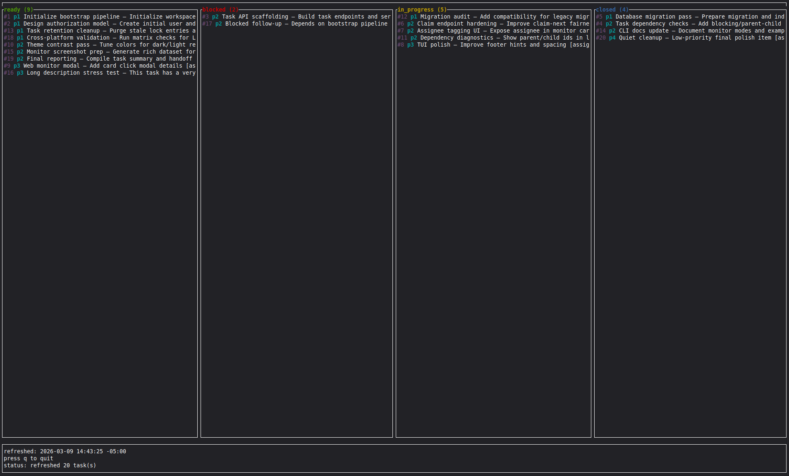
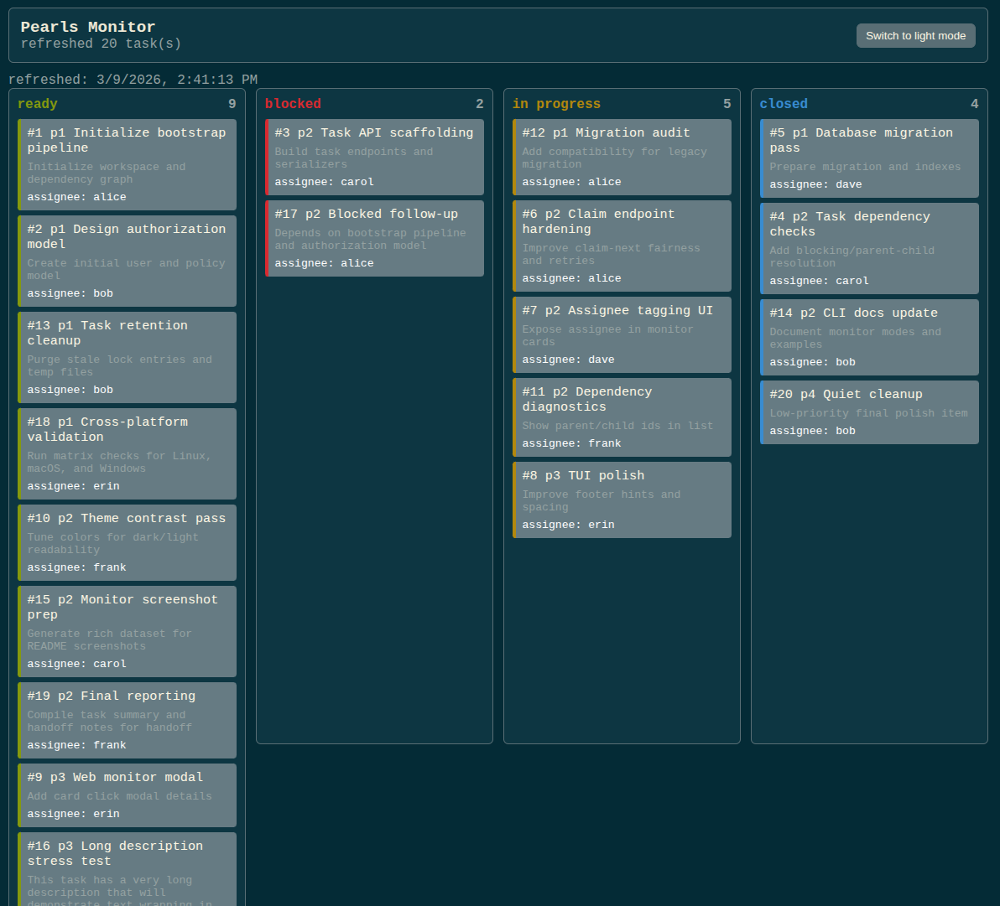
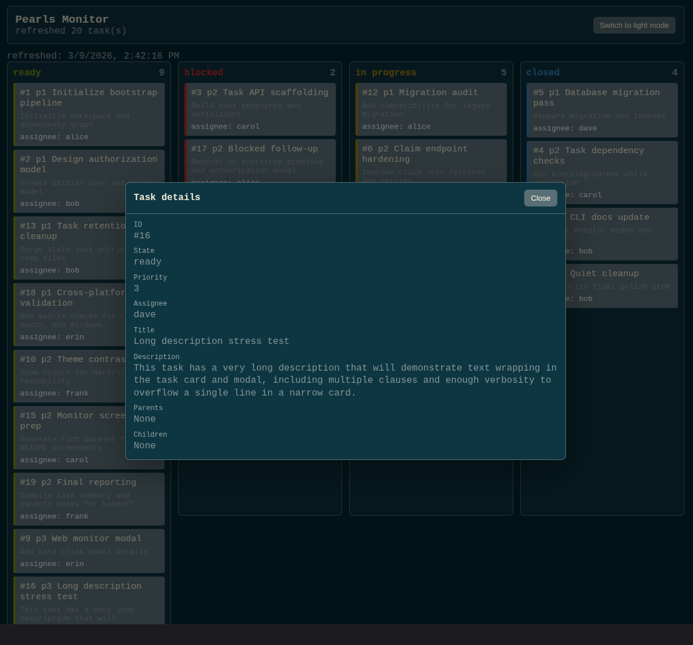

# Pearls

Pearls is a lightweight alternative to `beads` for managing long-running task graphs. I found `beads` to be more heavyweight than I needed, so Pearls strips it down to the bare necessities.

It is designed for AI agents (especially coding agents) to organize and plan long-term work. It uses a SQLite database as the backing store and a flock-compatible file lock to prevent simultaneous write access by multiple operators. Output is human-readable by default, with an optional `--json` flag for every command to make it machine-friendly.

## Installation

### Install via Cargo

```bash
cargo install pearls
```

### Download a Release Binary

1. Download the archive for your platform from the GitHub Releases page.
2. Extract the archive.
3. Make the binary executable (macOS/Linux only):

```bash
chmod +x pearls
```

4. Move it somewhere on your `PATH` (example):

```bash
mv pearls /usr/local/bin/pearls
```

## Intended Use

- Generate the usage snippet with `pearls agent instructions` and add it to your `AGENTS.md`.
- Store the database somewhere convenient (configurable via `PEARLS_DB`).
- Load your task graph.
- Turn your agent(s) loose.

## AGENTS.md Snippet

Print the snippet with:

```bash
pearls agent instructions
```

Expected output:

```text
## Work Tracking Instructions
### Overview
Pearls is a lightweight CLI for managing a task graph. Pearls tasks can be assigned parents, children, and priorities. Parent tasks block child tasks and must be completed and closed before child tasks are ready to be worked.
Database path defaults to ./pearls.db and can be overridden with PEARLS_DB.
Use --json on any command to emit machine-readable output.

Commands:
- pearls tasks list [--state ready,blocked,in_progress,closed]
- pearls tasks claim-next [--assignee <ASSIGNEE>]
- pearls tasks add --title <title> --description <desc> [--assignee <ASSIGNEE>] [--parent-of <id>] [--child-of <id>] [--priority <num>]
- pearls tasks update-metadata --id <id> [--title <title>] [--desc <desc>] [--priority <num>] [--state <state>] [--assignee <ASSIGNEE>] [--no-assignee]
- pearls tasks update-dependency --id <id> [--add-child <id> ...] [--remove-child <id> ...]

### Workflow
- claim the next ready task with `pearls tasks claim-next`
- when done, close the task with `pearls tasks update-metadata`
- if any new subtasks need to be created as a result of working your in progress task, create them with `pearls tasks add` and make sure to set their dependencies appropriately
```

## Behavior Notes

- `tasks list` includes parent and child IDs for each task.
- A task is reported as `blocked` if any of its parents are not `closed`.
- `tasks list` defaults to `ready,blocked,in_progress` and accepts a comma-separated `--state` list (include `closed` explicitly if you want it).
- Writes (`add`, `update-metadata`, `update-dependency`) take an exclusive file lock. Reads do not.

## Monitor Modes

Pearls now includes two monitoring modes to visualize task status.

- `monitor tui`: Terminal dashboard with four columns (`ready`, `blocked`, `in_progress`, `closed`), refreshed periodically.
- `monitor web`: Browser dashboard served from an embedded page, including a light/dark toggle.

Examples:

```bash
# Start web monitor on localhost:9187 (defaults)
pearls monitor web

# Override host and port
pearls monitor web --host 0.0.0.0 --port 3000

# Start terminal monitor with 5-second refresh interval (default)
pearls monitor tui

# Use a shorter terminal refresh interval
pearls monitor tui --refresh-interval 2
```

Notes:

- Both monitor modes read directly from the database and organize tasks by state.
- The terminal mode responds to `q`/`Esc` to quit and `r` to refresh immediately.
- The web mode polls for updates periodically and serves the UI from `/`.

## Screenshots

### Terminal monitor



### Web monitor



### Task details modal in web monitor



## Configuration

- `PEARLS_DB`: optional path to the SQLite database. If unset, it defaults to `./pearls.db`.

## JSON Output

Add `--json` to any command to output JSON:

```bash
pearls --json tasks list
pearls --json tasks add --title "Example" --description "Example description"
```
